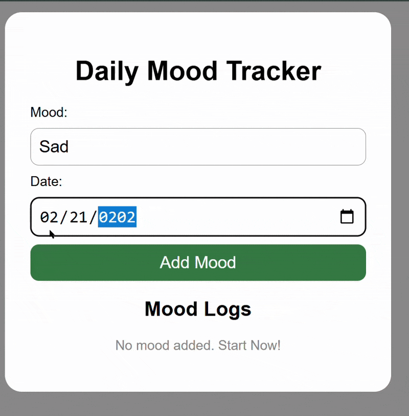

"Daily Mood Tracker App"

A "web-based Mood Tracker" built with HTML, CSS, and JavaScript. Track your daily moods, view logs, and delete entries when needed.  

Demo:

Live:https://maham2104.github.io/mood-tracker-app/

Features:

- Add daily moods with the corresponding date.
- View mood logs in a clean list format.
- Delete unwanted entries easily.
- Simple and responsive design.

How to Use:

1. Open `index.html` in your browser.
2. Enter your mood and select the date.
3. Click Add Mood to save your entry.
4. Delete entries using the Delete button.

Project Structure:

mood-tracker-app/
├── index.html
├── style.css
├── script.js
├── demo.gif

Features:
  - Add daily moods
  - View logs
  - Delete entries
    
Technologies:
  - HTML
  - CSS
  - JavaScript

License:
 MIT License

